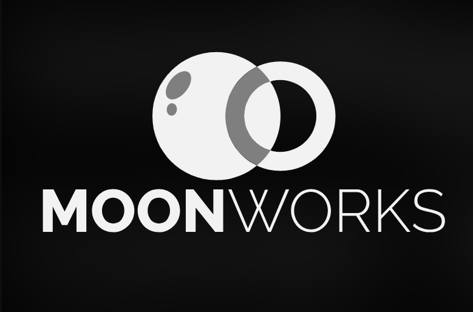
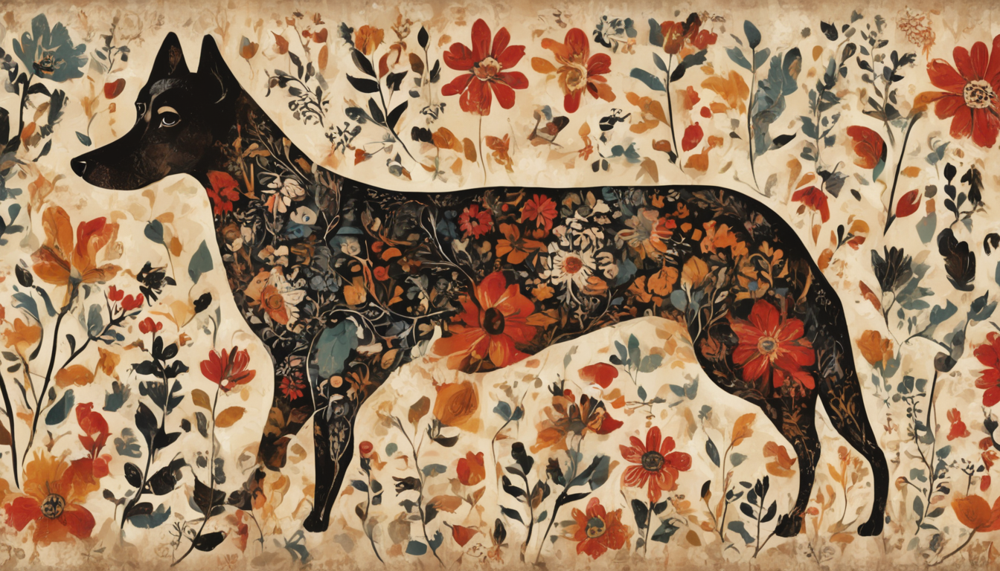

  

<h1 align="center">Moonworks Frontier Sovereign AI for Text • Speech • Vision</h1>

  Proprietary deep-tech to make frontier AI <b>economically viable</b> for builders, investors and end users.

  
  
  

---

## ✨ Hello World

Moonworks is building proprietary **Sovereign AI** at the deep-tech layer, advancing all three core wings of AI: **text, speech, and vision**.

At the core, we’ve developed a paradigm-shifting pretraining method, **CAT (Composite Active Transfer)**, that **cuts compute** while enabling unprecedented agility across new languages and domains.

We pioneer Sovereign AI so nations and enterprises can own, govern, and scale their AI—preserving data sovereignty and cultural identity while unlocking innovation.

**Our mission**
- Deliver secure, adaptable **omnimodal AI** tailored to local & cultural context.
- Make AI **accessible and cost-efficient** via proprietary models and infrastructure.

---

## 🧭 Table of Contents
- [CAT (Composite Active Transfer)](#-cat-composite-active-transfer)
- [MoonAI Model Family](#-moonai-model-family)
  - [Lunara (Vision)](#lunara-vision)
  - [MoonWave (Audio)](#moonwave-audio)
  - [Selenix (Text)](#selenix-text)
- [Demos](#-demos)
- [Why Sovereign AI?](#-why-sovereign-ai)
- [Get Involved](#-get-involved)
- [Links](#-links)

---

## 🐈‍⬛ CAT (Composite Active Transfer)

> **TL;DR**: CAT builds a **latent-space bridge** between *understanding* and *generation*, letting models acquire new languages/domains quickly and cheaply.

### The Problem
Most non-giant LLMs excel in English and a few high-resource languages (e.g., Chinese, French) but **struggle elsewhere**. Standard fine-tuning can’t invent foundational knowledge of a new language, and continual pretraining often forgets previous skills or demands starting over.

### The radically new CAT Approach
- **Composite objectives** that actively balance understanding ↔ generation.
- **Understanding-first curriculum** that bootstraps into generation.

> _Historical note:_ Natural-language understanding has required far less compute than generation (e.g., masked-LM era). CAT leverages that gap to accelerate generative capabilities.

<b>Key Properties</b>

- **Latent Bridge** — Aligns NLU representations with generative heads.
- **Language Agility** — Designed to leap the “language learning barrier.”
- **Domain Portability** — From general → specialized corpora with minimal cost.

---

## 🌙 MoonAI Model Family

Omnimodal AI built for **cultural fidelity** and **sovereign deployment**.

### Lunara (Vision)
Captures the **soul of art** with respect and cultural depth. We partner with artists and use public-domain imagery to reflect the voices of artists and cultures.  
Supports **100+ styles**, including Scandinavian folk, Skagen, Korean traditional, Middle-Eastern painting, ancient Indian, and traditional Syrian.

  
  
  
  
  
  

**Highlights**
- Cultural and stylistic fidelity across 100+ art traditions  
- Respectful dataset strategy: artist partnerships + public domain
- Ready for sovereign, on-premise workflows

---

### MoonWave (Audio)
Turns simple audio into **expressive, production-ready sound**—even on minimal infrastructure. Generates **native-sounding voice** and can **blend background music & SFX**.

- Multi-voice speech synthesis  
- Built-in music/SFX composition  
- Edge-friendly inference for on-prem setups

👉 **[Open MoonWave Audio Demos ›](https://moonworks-ai.github.io/.github/)**

---

### Selenix (Text)
Bridges cultures to turn every message into a meaningful connection. **Lightweight** and **on-prem deployable**.

**Currently supports**: English, Arabic, Bengali, Swedish, Danish, Norwegian, Korean (more in pipeline).

  
  

**Highlights**
- Private by default • on-prem friendly  
- Tailored to local & cultural context  
- Efficient training via **CAT** for rapid language/domain lift

---

## 🎛 Demos
- **MoonAI Overview:** https://moonworks.ai/moonai  
- **Moonstone Agent:** https://moonworks.ai/agents  
- **MoonWave Audio Demos:** https://moonworks-ai.github.io/.github/

---

## 🏛 Why Sovereign AI?
- **Ownership & Governance** — Keep sensitive data and model weights under your jurisdiction.  
- **Cultural Fidelity** — Systems that truly understand local languages, idioms, and art styles.  
- **Operational Control** — Deploy on-prem or air-gapped; tune for domain-specific needs.  
- **Cost Efficiency** — CAT slashes adaptation costs, enabling agile iteration.

---

## 🤝 Get Involved
- Questions or partnership interest?  **reach out** via our website or **email** sabit@moonworks.ai
- Want early access to research artifacts or pilots? **Contact us** and describe your use case.

---

## 🔗 Links
- Website: https://moonworks.ai/  
- MoonAI: https://moonworks.ai/moonai  
- Moonstone Agent: https://moonworks.ai/agents  
---

  © {YEAR} Moonworks. All rights reserved.

